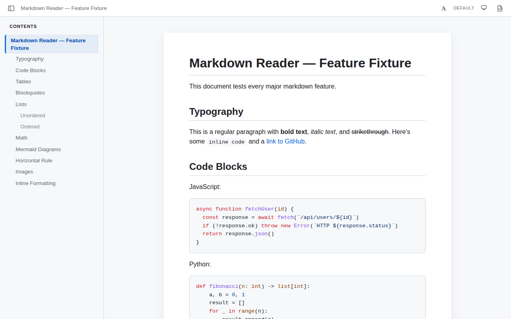
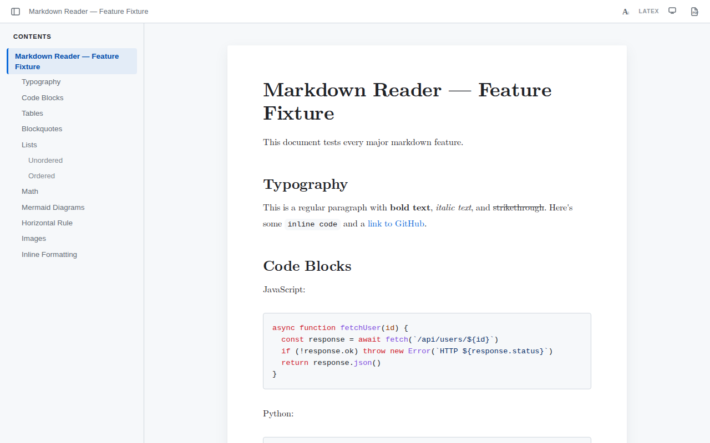
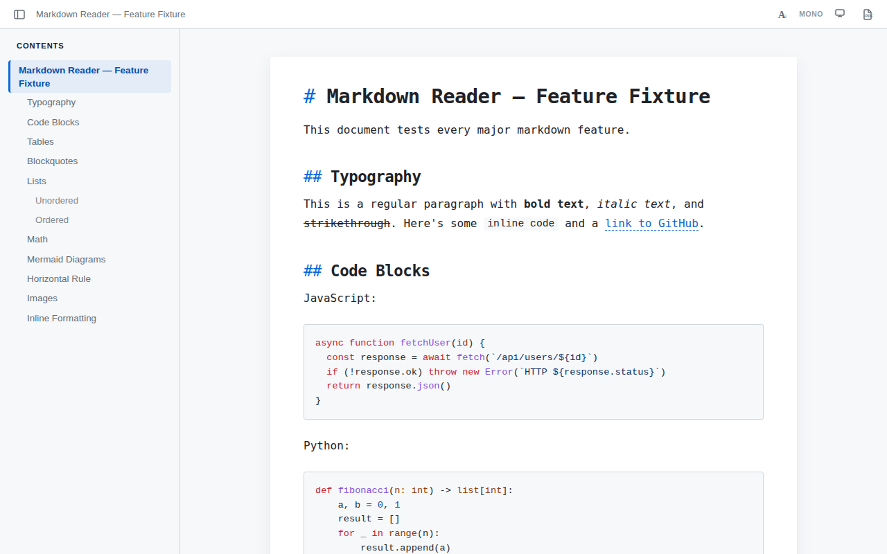
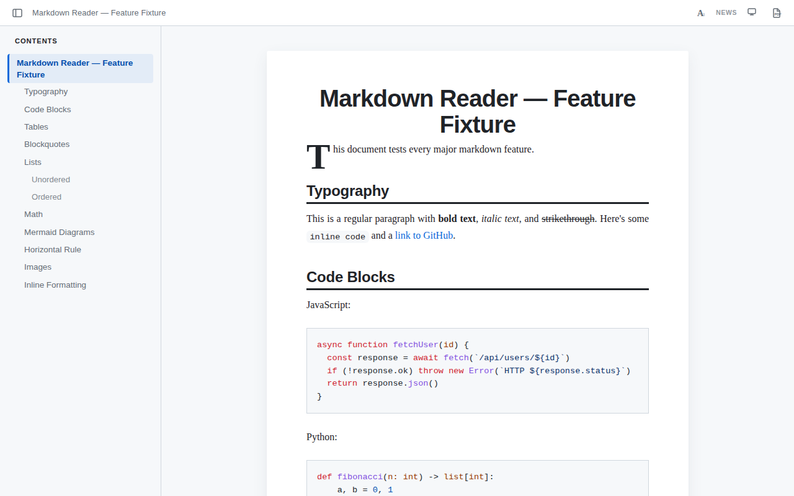
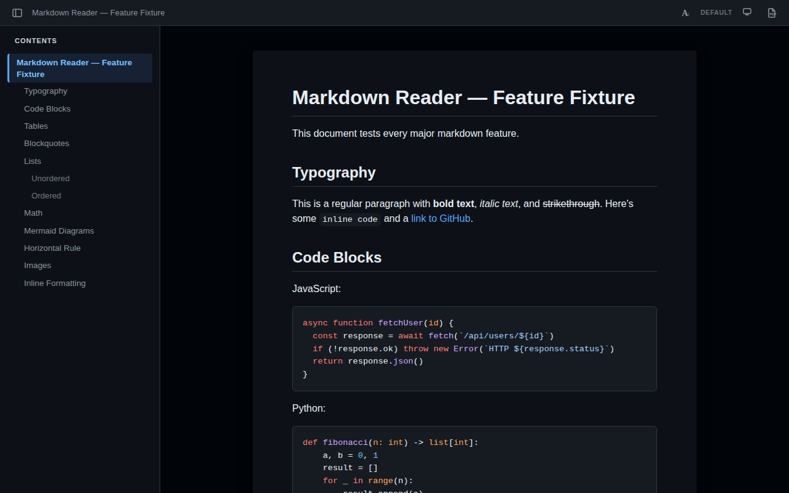

# markdown-reader

 

CLI tool and desktop app that renders markdown files as a beautiful HTML reading experience.

GitHub-style rendering, dark/light theme, switchable style presets, syntax highlighting, math support, live reload, PDF export — all self-contained with zero external requests.



## Features

- **GitHub-style default** — renders markdown with GitHub's color palette, typography, and spacing
- **4 style presets** — Default (GitHub), LaTeX, Mono, Newspaper — cycle with toolbar button
- **Self-contained HTML** — all CSS inlined, no external dependencies
- **Dark and light themes** — follows system preference, or toggle light / dark / system
- **GitHub Flavored Markdown** — tables, task lists, strikethrough, autolinks
- **Math rendering** — KaTeX MathML output (zero CSS/fonts, works in modern browsers)
- **Syntax highlighting** — via highlight.js with GitHub Light/Dark color schemes
- **Interactive sidebar** — auto-generated TOC with scroll spy, collapsible
- **Linked .md navigation** — click `.md` links to open them rendered as HTML
- **Anchor links** — `#heading` links smooth-scroll to the correct section
- **Find-in-page** — `Ctrl+F` overlay with match highlighting and navigation
- **Zoom controls** — `Ctrl+=` / `Ctrl+-` / `Ctrl+0` with persistent zoom level
- **Live reload** — `--watch` mode with WebSocket hot-refresh
- **PDF export** — `--pdf` via headless Chrome/Edge/Chromium
- **LaTeX font embedding** — `--latex-font` inlines Latin Modern Roman for authentic LaTeX typography
- **Desktop app** — native Tauri v2 window with file watching, style presets, and smooth transitions
- **Keyboard navigation** — `j`/`k` scroll, `Space`/`Shift+Space` page, `Home`/`End`, `Ctrl+B` sidebar
- **Default app registration** — `--set-default` makes md-reader the default handler for `.md` files
- **OS integration** — right-click "Open with" on Windows and Linux, with custom app icon

## Style Presets

Cycle between four reading styles via the toolbar button or `Ctrl+S`:

| Default (GitHub) | LaTeX |
|:-:|:-:|
|  |  |

| Mono | Newspaper |
|:-:|:-:|
|  |  |

**Dark mode** adapts all presets automatically:



## Installation

### CLI (requires Bun)

```bash
# Clone and link globally
git clone https://github.com/mj-deving/markdown-reader.git
cd markdown-reader
bun install
bun link
```

Now `md-reader` is available system-wide:

```bash
md-reader README.md
```

### Desktop App (pre-built installers)

Download the latest release from [GitHub Releases](https://github.com/mj-deving/markdown-reader/releases):

| Platform | File | Install |
|----------|------|---------|
| Windows | `md-reader_*_x64-setup.exe` | Run the installer |
| Windows | `md-reader_*_x64_en-US.msi` | `msiexec /i md-reader_*.msi` |
| Linux (Debian/Ubuntu) | `md-reader_*_amd64.deb` | `sudo dpkg -i md-reader_*.deb` |
| Linux (any) | `md-reader_*_amd64.AppImage` | `chmod +x *.AppImage && ./*.AppImage` |

> **Windows SmartScreen:** The installers are not yet code-signed, so Windows may show a "Windows protected your PC" warning. Click **More info** then **Run anyway** to proceed.

### Set as Default App

Register md-reader as the default handler for `.md` files (double-click to open):

```bash
md-reader --set-default
```

This sets up both Linux (XDG MIME) and Windows (registry) associations with the app icon.

## Usage

```
md-reader <file.md> [options]
```

### Options

| Flag | Description |
|------|-------------|
| `--watch`, `-w` | Watch for changes and live-reload in browser |
| `--style <name>` | Set initial style preset: `default`, `latex`, `mono`, `newspaper` |
| `--latex-font` | Embed Latin Modern Roman font in LaTeX style (self-contained) |
| `--pdf` | Export as PDF (requires Chrome, Edge, or Chromium) |
| `--output <path>` | Save HTML/PDF to a specific path |
| `--no-open` | Convert but don't open in browser |
| `--set-default` | Register as the default app for `.md` files |
| `--version` | Show version |
| `--help` | Show help |

### Examples

```bash
# Open rendered markdown in browser
md-reader README.md

# Live-reload while editing
md-reader README.md --watch

# Use LaTeX-style typography with embedded font
md-reader README.md --style latex --latex-font

# Export to PDF
md-reader README.md --pdf

# Export PDF to specific path
md-reader README.md --pdf --output ~/Desktop/readme.pdf

# Convert only, don't open browser
md-reader docs/guide.md --no-open

# Register as default .md handler
md-reader --set-default
```

### Keyboard Shortcuts

| Key | Action |
|-----|--------|
| `j` / `k` | Scroll down / up |
| `Space` / `Shift+Space` | Page down / up |
| `Home` / `End` | Jump to top / bottom |
| `Ctrl+B` | Toggle sidebar |
| `Ctrl+F` | Find in page |
| `Ctrl+=` / `Ctrl+-` | Zoom in / out |
| `Ctrl+0` | Reset zoom |

## Development

```bash
# Prerequisites: Bun 1.3+, Rust (for Tauri app)
bun install

# Run CLI directly
bun run src/cli.ts README.md

# Tauri desktop app (requires Rust + system deps)
cd tauri-app
npm install
npx tauri dev -- -- ../README.md
```

## Security

- **HTML sanitization** — `rehype-sanitize` strips all dangerous HTML from markdown input
- **Content Security Policy** — Tauri WebView enforces `script-src 'self'` (no inline scripts)
- **No shell injection** — all process spawning uses array args, never shell strings
- **Path traversal protection** — linked file resolution validates paths stay within source directory
- **DNS rebinding protection** — watch mode validates Host header on all requests
- **Supply chain hardening** — CI actions pinned to commit SHAs, not mutable tags
- **Minimal permissions** — Tauri app has empty capabilities (no filesystem/shell/network access from WebView)

## Tech Stack

- **Runtime:** Bun + TypeScript
- **Markdown:** unified + remark-parse + remark-gfm + remark-math + remark-rehype + rehype-slug + rehype-katex (MathML) + rehype-sanitize + rehype-highlight + rehype-stringify
- **Desktop:** Tauri v2 (Rust backend + WebView frontend)
- **CI/CD:** GitHub Actions — tag push triggers cross-platform release builds

---

**Author:** Marius
